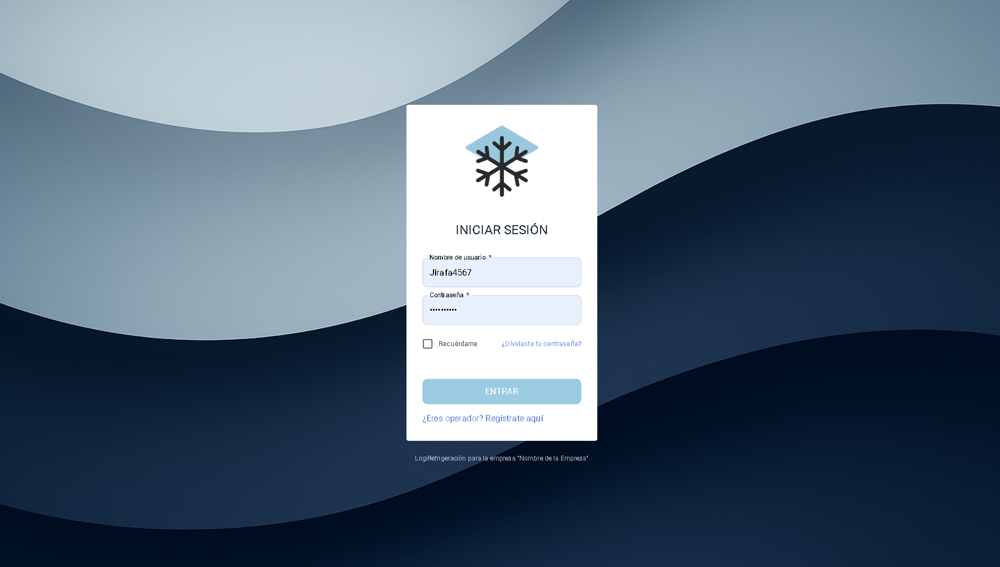
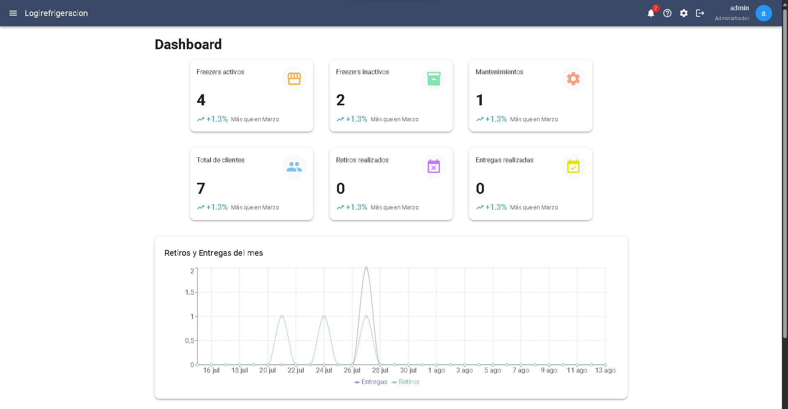
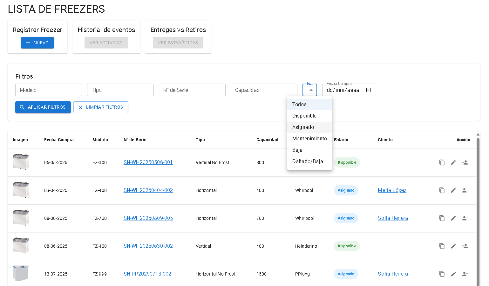
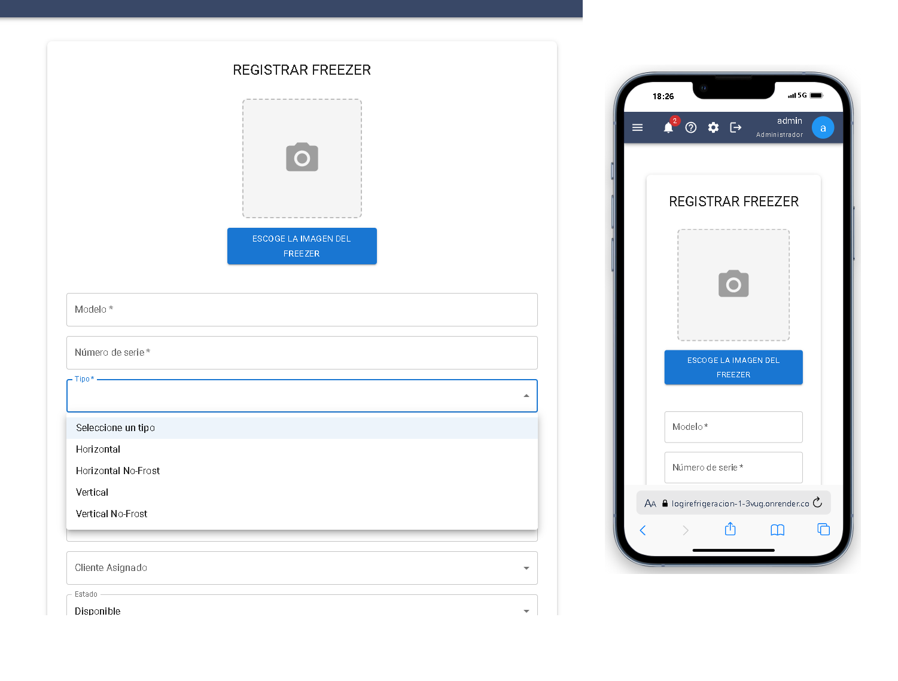
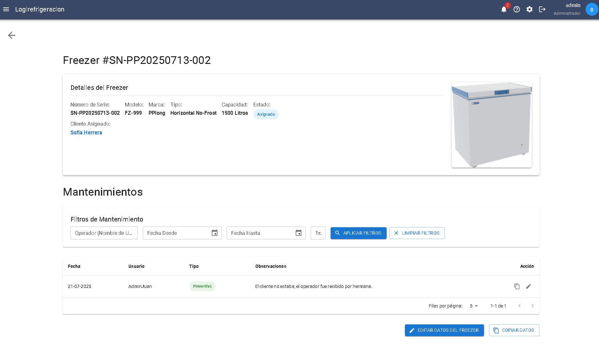
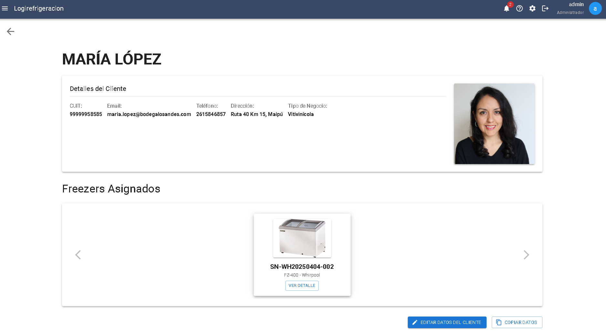
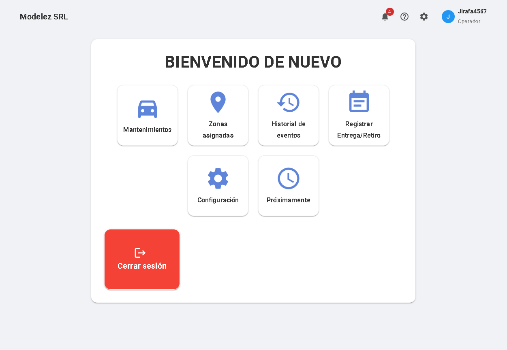
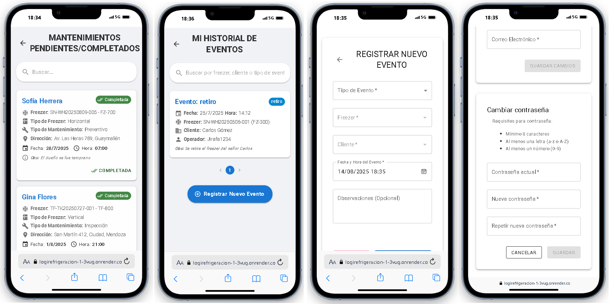

# ❄️ LogiRefrigeración

**LogiRefrigeración** es un sistema de gestión de logística y control de freezers para empresas de distribución de productos refrigerados. El sistema permite a administradores y operadores gestionar clientes, eventos de entrega y retiro de equipos, auditorías y más.

## 📷 Capturas
### Administrador







### Operador




## 🚀 Tecnologías utilizadas

-   **Frontend:** React JS + Vite
-   **Estilo:** Material UI (MUI)
-   **Backend:** Node.js + Express
-   **Base de datos:** MySQL
-   **Autenticación:** JWT (JSON Web Tokens)
-   **ORM:** Ninguno (consultas SQL directas)
-   **Control de versiones:** Git + GitHub

## 📦 Estructura del proyecto

```bash
logirefrigeracion/
│
├── backend/ # Servidor Express (Node.js)
│   ├── config/ # Configuración DB y JWT
│   ├── controllers/ # Lógica de negocio
│   ├── routes/ # Endpoints
│   ├── database/ # Scripts SQL para la base de datos
│   └── ...
│
├── frontend/ # Aplicación React
│   ├── src/
│   │   ├── components/ # Componentes reutilizables (NavBar, Forms, etc.)
│   │   ├── pages/ # Páginas principales
│   │   ├── layouts/ # Layouts compartidos (DashboardLayout)
│   │   ├── api/ # Servicios axios
│   │   ├── context/ # Contextos globales (Auth, Notificaciones)
│   │   └── styles/ # Archivos CSS
│   └── ...
└── README.md
```
## Funcionalidades

- Login con autenticación por rol (Administrador u Operador)
- Dashboard personalizado según el rol
- ABM de clientes, freezers y zonas
- Registro de eventos (entrega/retiro de freezers)
- Auditoría de actividades del sistema
- Módulo de notificaciones automáticas
- Validaciones de estado coherente de freezers
- Rutas protegidas con JWT
- Diseño responsive

## Estado del proyecto
[x] Backend funcional con rutas protegidas
[x] Autenticación con JWT implementada
[x] Sistema de auditoría listo
[x] Validaciones de estados de cada entidad
[x] Login funcional
[ ] Frontend base
[ ] UI de dashboards en desarrollo
[ ] Integración completa frontend-backend


## Instalación local
Para poner en marcha este proyecto en tu entorno local, sigue los siguientes pasos:

### 1. Requisitos previos
Asegúrate de tener instalado lo siguiente:

- Node.js (versión 18 o superior recomendada)
- npm (viene con Node.js)
- MySQL Server (versión 8.x recomendada)

### 2. Clonar el repositorio
```bash
git clone [https://github.com/tuusuario/logirefrigeracion.git](https://github.com/tuusuario/logirefrigeracion.git)
cd logirefrigeracion
```
### 3. Configuración de la Base de Datos
Este proyecto utiliza MySQL.

1. Asegúrate de que tu servidor MySQL esté corriendo.
2. Crea una nueva base de datos en tu servidor MySQL. Puedes nombrarla logirefrigeracion_db o cualquier otro nombre que elijas, pero asegúrate de que coincida con el DB_NAME en tu archivo .env.

```bash
CREATE DATABASE logirefrigeracion_db;
```
3. Importa el esquema de la base de datos para crear las tablas necesarias:
```bash
# Asegúrate de estar en la raíz del proyecto (logirefrigeracion/)
mysql -u tu_usuario_mysql -p logirefrigeracion_db < backend/database/schema.sql
```
- Nota: Se te pedirá la contraseña de tu usuario MySQL.
4. (Opcional) Importa datos de prueba para tener un entorno funcional rápidamente:

```bash
mysql -u tu_usuario_mysql -p logirefrigeracion_db < backend/database/seed.sql
```
- Reemplaza tu_usuario_mysql con el usuario que usas para MySQL (comúnmente root).
- Si encuentras un error de autenticación (ej. auth_gssapi_client), es posible que necesites actualizar el plugin de autenticación de tu usuario MySQL. Conéctate a MySQL y ejecuta:
```bash
ALTER USER 'tu_usuario_mysql'@'localhost' IDENTIFIED WITH mysql_native_password BY 'tu_contraseña_mysql';
FLUSH PRIVILEGES;
```
(Ajusta localhost a % si es necesario, y recuerda reemplazar los valores de usuario y contraseña).

### 4. Configuración de Variables de Entorno
El proyecto utiliza variables de entorno para la configuración sensible (credenciales de base de datos, secretos de JWT, etc.).

1. En la carpeta backend/, crea un archivo llamado .env y copia el contenido de backend/.env.example en él.
```bash
# backend/.env
DB_HOST=localhost
DB_USER=root
DB_PASSWORD=
DB_NAME=logirefrigeracion_db
JWT_SECRET=tu_secreto_super_seguro_y_largo_aqui
PORT=3200
```
- Asegúrate de rellenar DB_USER, DB_PASSWORD y DB_NAME con las credenciales de tu propia configuración MySQL.
- Cambia JWT_SECRET por una cadena de caracteres aleatoria y larga para asegurar tu aplicación.
2. (Si tu frontend usa variables de entorno en un .env separado, añade esta sección):
En la carpeta frontend/, crea un archivo llamado .env y copia el contenido de frontend/.env.example en él. (Asegúrate de crear este archivo si lo necesitas).

### 5. Instalar dependencias

```bash
# Navega a la carpeta del backend e instala
cd backend
npm install

# Navega a la carpeta del frontend e instala
cd ../frontend
npm install
```
### 6. Ejecutar el proyecto
Para iniciar la aplicación, necesitas levantar tanto el servidor backend como el frontend.

1. Iniciar el Backend:
Abre una nueva terminal, navega a la carpeta backend/ y ejecuta:

```bash
npm start
```
- Verás un mensaje indicando que el servidor está escuchando en http://localhost:3200.

2. Iniciar el Frontend:
Abre otra nueva terminal, navega a la carpeta frontend/ y ejecuta:


```bash
npm run dev
```

- La aplicación frontend se iniciará y generalmente se abrirá automáticamente en tu navegador (por defecto en http://localhost:5173 si usas Vite).

👩‍💻 Autora
Celina Fioretti – Proyecto académico para la carrera de Desarrollo de Software – Centro Regional Universitario IUA Universidad de la Defensa Nacional UNDEF Año 2025.
